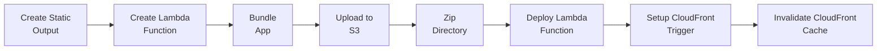

# AWS adapter for SvelteKit

An adapter to build a [SvelteKit](https://kit.svelte.dev/) app which is aws ready for deployment with [cloudfront](https://aws.amazon.com/cloudfront/) [lambda@edge](https://docs.aws.amazon.com/lambda/latest/dg/lambda-edge.html) and [S3](https://aws.amazon.com/s3/).

## Installation

1. Install [AWS CLI](https://docs.aws.amazon.com/cli/latest/userguide/getting-started-install.html) in local machine

2. [Configure authentication and access credentials](https://docs.aws.amazon.com/cli/latest/userguide/cli-chap-authentication.html) in AWS CLI

3. Install adapter in your SvelteKit project
Use pnpm, yarn or npm to install the required package.

```sh
pnpm i -d @juspay/sveltekit-aws-adapter
```

## Usage

In `svelte.config.js` configure the adapter as below:

Lambda function should be in `us-east-1` for it to be used with cloudfront.

```js
import preprocess from 'svelte-preprocess';
import adapter from '@juspay/sveltekit-aws-adapter';

const config = {
  preprocess: preprocess(),
  kit: {
    adapter: adapter({
			s3: {
				bucketName: "some-bucket",
				prefix: "",
				region: "ap-south-1",
			},
			lambda: {
				functionName: "lambda-function-name",
				region: "us-east-1",
			},
			cloudfront: {
				distributionId: "distibution-id",
				region: "us-east-1",
			}
		}),
  },
};

export default config;
```

Adapter takes below config for different aws services.

## Build app

Generates the required files in a folder `/out`.
To be added to .gitignore for CI/CD system.

```sh
pnpm run build
```
Above command will do the below steps :



1. Create Static Output
    Copy assets using builder.writeClient(clientDir).
    Pre-render files using builder.writePrerendered(prerenderedDir).

2. Create Lambda Function

    Generate server function using builder.writeServer(serverDir).
    Copy handler files to the server handler folder using builder.copy.
    Save a list of pre-rendered files in the server handler folder using fs.writeFileSync.

3. Bundle App

    Execute bundleApp() to bundle the application.

4. Upload to S3

    Upload the contents of clientDir to S3 using uploadToS3.

5. Zip Directory

    Zip the contents of the build directory into a file named lambda.zip using zipDirectory.

6. Deploy Lambda Function

    Deploy the zipped lambda function using deployLambdaFunction.
    Get the new version of the deployed Lambda function.

7. Setup CloudFront Trigger

    If the Lambda version is obtained successfully, setup the CloudFront trigger using setupCloudFrontTrigger.

8. Invalidate CloudFront Cache

    Invalidate the CloudFront cache using invalidateCache.

# AWS Configuration Interfaces

This documentation describes the TypeScript interfaces used to define the AWS configuration for your project.

AWSConfiguration interface is the main configuration interface that aggregates S3Config, LambdaConfig, and CloudFrontConfig.

```typescript

interface AWSConfiguration {
  s3: S3Config;          // Configuration for AWS S3.
  lambda: LambdaConfig;   // Configuration for AWS Lambda.
  cloudfront: CloudFrontConfig;  // Configuration for AWS CloudFront.
}
```

## S3Config

`S3Config` interface represents the configuration for AWS S3.

```typescript
interface S3Config {
  bucketName: string;  // The name of your S3 bucket.
  prefix: string;      // The prefix to use for objects in the bucket.
  region: string;      // The AWS region where your S3 bucket is hosted.
}
```

## LambdaConfig

LambdaConfig interface represents the configuration for AWS Lambda.

```typescript

interface LambdaConfig {
  functionName: string;  // The name of your Lambda function.
  region: string;       // The AWS region where your Lambda function is hosted.
}
```
### CloudFrontConfig

CloudFrontConfig interface represents the configuration for AWS CloudFront.

```typescript

interface CloudFrontConfig {
  distributionId: string;  // The ID of your CloudFront distribution.
  region: string;          // The AWS region where your CloudFront distribution is hosted.
}
```
